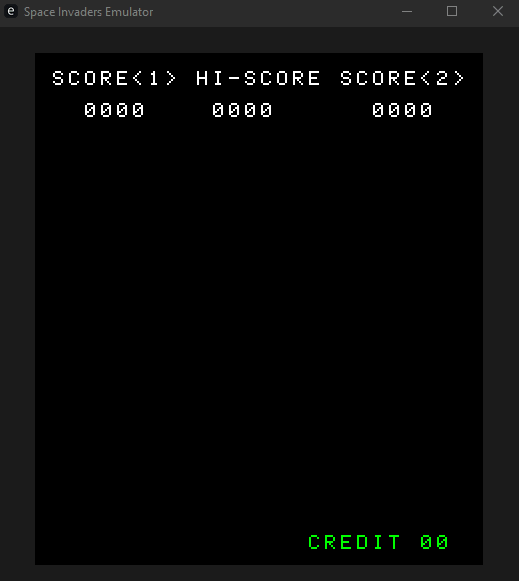

# space-invaders-emulator

This is an emulation of the Space Invaders arcade cabinet writen in Rust. The GUI and input bindings are powered by [egui](https://github.com/emilk/egui) and [eframe](https://docs.rs/eframe/latest/eframe/).



## Running the Emulator

Before launching the emulator you need to source the ROM files for Space Invaders, often found in four separate parts `invaders.e`, `invaders.f`, `invaders.g`, and `invaders.h`. After acquring these files either place then in the project root if running via `cargo` or place them next to the executable file.

To launch the emulator with Cargo simply run it in the project root:

```
cargo run
```

## Key Bindings

This emulator has fixed key bindings as described her.

```
SPACE : Add Credit
1 (Row or Numpad) : Start 1 Player game
2 (Row or Numpad) : Start 2 Player game
W : Player 1 Shoot
A : Player 1 Move Left
D : Player 1 Move Right
Up Arrow : Player 2 Shoot
Left Arrow : Player 2 Move Left
Right Arrow : Player 2 Move Right
ESC : Close Emulator
```

## Resources

* [Computer Archeology Space Invaders Documentation](https://computerarcheology.com/Arcade/SpaceInvaders/)
* [pastraiser.com 8080 opcode table](https://pastraiser.com/cpu/i8080/i8080_opcodes.html)
* [Intel 8080 Programming Manual](https://altairclone.com/downloads/manuals/8080%20Programmers%20Manual.pdf)
* [emulator101.com](https://emulator101.com/)